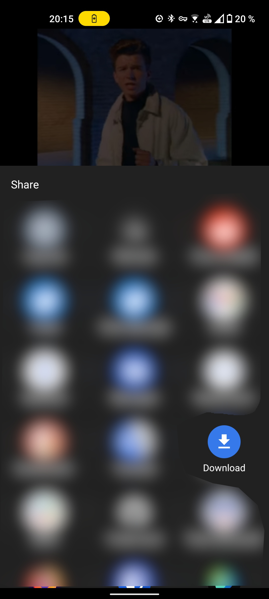
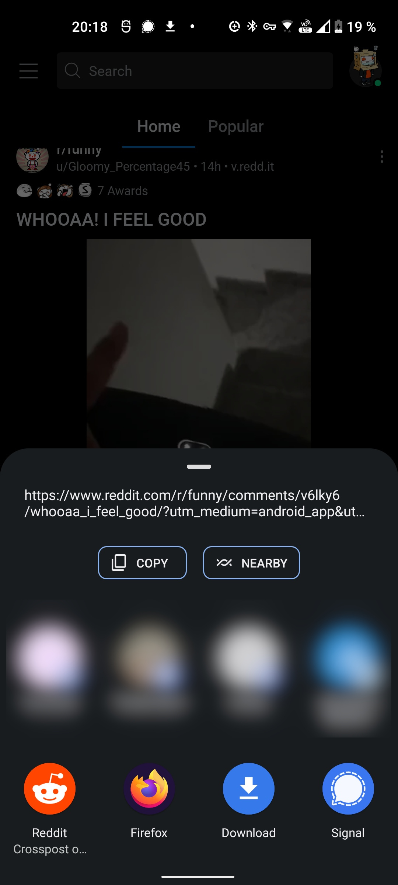

# Downloader App
This app lets you download videos from Reddit, YouTube, Twitter, Tik Tok and other platforms
with just 2 clicks using [this](https://github.com/yausername/youtubedl-android) android wrapper
for yt-dlp.

## Screenshots

|  |  |
|:---:|:---:|
| YouTube | Reddit

## Supported Platforms
Currently supported and tested platforms (not complete)
* Reddit
* YouTube
* Twitter
* Tik Tok

## How to use
After this app is installed it will start to appear in the share menu in many apps. To
download a video just use the apps standard share feature and select Download. If everything
works you should now see a new notification indicating the status of the current download.
